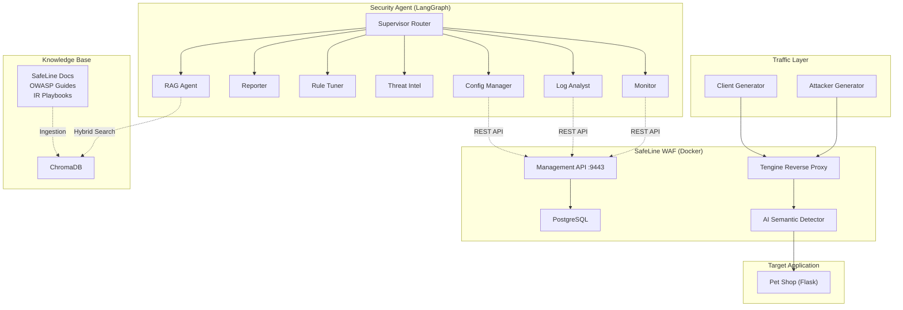

# Security Agent

> **An AI-powered, multi-agent assistant for operating [SafeLine WAF](https://github.com/chaitin/SafeLine/tree/main) through natural language.**

[](https://www.python.org/downloads/)
[](https://langchain-ai.github.io/langgraph/)
[](LICENSE)

---

## What Is This?

**Security Agent** is a multi-agent system that lets engineers monitor, configure, and troubleshoot a [SafeLine](https://github.com/chaitin/SafeLine/tree/main) Web Application Firewall using conversational AI — instead of clicking through dashboards or writing API calls by hand.

Built with **LangGraph**, it routes each user request to the right specialist agent, calls the SafeLine REST API, searches a RAG knowledge base, and returns actionable answers in plain English.

### Key Capabilities

| Agent | What It Does |
|---|---|
| **Monitor** | Reads real-time QPS, request counts, and error rates from the SafeLine API |
| **Log Analyst** | Retrieves and summarises attack events with pattern recognition |
| **Config Manager** | Switches protection modes, manages IP blacklists/whitelists, and creates rules |
| **Threat Intel** | Maps detected attacks to CVE/CWE identifiers and OWASP Top-10 categories |
| **Rule Tuner** | Investigates false positives and recommends whitelist entries |
| **Reporter** | Generates structured incident reports with timeline and recommendations |
| **RAG Agent** | Answers "how do I…" questions by searching SafeLine docs, OWASP guides, and IR playbooks |

A **supervisor node** inspects every incoming message and routes it to the most appropriate agent — making the system feel like a single knowledgeable assistant.

---

## Architecture



---

## Tech Stack

| Layer | Technology |
|---|---|
| WAF | [SafeLine](https://github.com/chaitin/SafeLine/tree/main) — semantic-analysis WAF (7 Docker containers) |
| Target App | Flask + SQLite (intentionally vulnerable) |
| Agent Framework | LangGraph with supervisor routing |
| LLM Providers | OpenAI \| Google Gemini \| vLLM (local) |
| Vector Store | ChromaDB |
| Retrieval | Hybrid search — semantic (all-MiniLM-L6-v2) + BM25 + RRF |
| Evaluation | Custom routing + keyword evaluation framework |

---

## Quick Start

### Prerequisites

- **Docker & Docker Compose**
- **Python 3.11+**
- **[uv](https://docs.astral.sh/uv/)** — fast Python package manager
- An LLM API key (OpenAI, Google Gemini, or a local vLLM endpoint)

### 1. Install Dependencies

```bash
cd security-agent
uv venv && source .venv/bin/activate
uv pip install -e ".[dev]"

cp .env.example .env
# → edit .env with your LLM provider key
```

### 2. Deploy SafeLine WAF

Use the automated one-command setup (works on both Linux and WSL2):

```bash
bash scripts/safeline.sh up
```

This command is intentionally non-interactive and does:
- Full SafeLine reset (removes old SafeLine containers, volumes, and `/data/safeline`)
- Fresh install via the official SafeLine installer
- Auto-detects platform:
  - WSL2: patches tengine to bridge mode and uses traffic port `8888`
  - Linux: also uses bridge mode with traffic port `8888`
- Stack restart and readiness checks (`9443` + traffic port)

Optional platform override:

```bash
bash scripts/safeline.sh up --platform wsl
bash scripts/safeline.sh up --platform linux
```

Access the management UI at **https://localhost:9443**.

Reset the admin password and generate an API token:

```bash
sudo docker exec safeline-mgt resetadmin
```

1. Log in at **https://localhost:9443** with `admin` / the password above
2. Go to **Settings → API Token** → generate a token
3. Add it to `.env`:
   ```
   SAFELINE_API_TOKEN=<your-token>
   ```

Useful commands:

```bash
bash scripts/safeline.sh status
bash scripts/safeline.sh down
```

### 3. Start the Target App

```bash
docker compose up -d
```

### 4. Register the App with SafeLine

```bash
python -m security_agent.setup_site
```

### 5. Ingest the Knowledge Base

```bash
python -m security_agent.ingest
```

### 6. Launch Security Agent

```bash
python -m security_agent.assistant
```

You can now chat with the agent:
- *"What's my current traffic?"*
- *"Show me recent attack logs"*
- *"Switch to blocking mode"*
- *"How do I set up rate limiting?"*

---

## Demo Walkthrough

The demo below walks through a realistic scenario to illustrate what Security Agent can do.
It is **not** the project's primary purpose — the agent works with any live SafeLine deployment.

<details>
<summary><strong>Expand: 5-phase demo (~16 min)</strong></summary>

### Phase 1 — Normal Traffic (~2 min)

```bash
python -m security_agent.traffic --mode client --target http://localhost:8888
```

Simulated users browse Pet Shop. SafeLine logs clean traffic.

### Phase 2 — Attack Without Blocking (~2 min)

```bash
python -m security_agent.traffic --mode attacker --target http://localhost:8888
```

Attacks succeed (SQLi, XSS, path traversal). SafeLine detects them but is in **detect-only** mode.

### Phase 3 — Ask Security Agent for Help (~5 min)

```bash
python -m security_agent.assistant
```

- **"What's happening?"** → reads SafeLine logs, identifies attacks
- **"Enable blocking"** → switches SafeLine to BLOCK mode via API
- **"Block that IP"** → adds attacker IP to the blacklist

### Phase 4 — Verify Protection (~2 min)

```bash
python -m security_agent.traffic --mode attacker --target http://localhost:8888
```

All attacks now blocked (403). Confirm via the agent or SafeLine dashboard.

### Phase 5 — Post-Incident (~5 min)

- False positive tuning — *"A customer can't search for 'script writing tips'"*
- CVE correlation — *"What CVEs match these SQL injection attacks?"*
- Incident report — *"Generate an incident report"*
- Documentation — *"How do I configure rate limiting?"*

</details>

---

## SafeLine API Endpoints Used

| Endpoint | Purpose |
|---|---|
| `GET /api/open/events` | Attack event log |
| `GET /api/stat/qps` | Real-time QPS |
| `GET /api/dashboard/intercepts` | Block statistics |
| `GET\|PUT /api/open/global/mode` | Protection mode |
| `GET\|POST /api/open/policy` | Custom WAF rules |
| `GET\|POST /api/open/ipgroup` | IP blacklist / whitelist |
| `GET /api/open/records/acl` | Blocked request details |
| `POST /api/open/site` | Register protected sites |
| `GET\|POST /api/open/global/acl` | Rate limiting |

---

## Project Structure

```
security-agent/
├── src/security_agent/
│   ├── assistant/           # LangGraph supervisor + 7 specialist nodes
│   │   ├── graph.py         # Supervisor graph definition
│   │   ├── nodes/           # Agent implementations
│   │   └── cli.py           # Interactive chat REPL
│   ├── tools/               # SafeLine API, CVE lookup, RAG search
│   ├── rag/                 # ChromaDB ingestion + hybrid retrieval
│   ├── llm/                 # Multi-provider LLM abstraction
│   ├── traffic/             # Client & attacker traffic generators
│   ├── eval/                # Routing + response evaluation framework
│   ├── petshop/             # Vulnerable Flask web app (demo target)
│   └── config.py            # Centralised settings
├── data/
│   ├── docs/                # RAG knowledge base (SafeLine, OWASP, IR)
│   └── eval/                # Evaluation test cases
├── scripts/                 # Helper scripts (WSL fix, evaluation runner)
├── docker-compose.yml
├── pyproject.toml
└── .env.example
```

---

## Evaluation

Run the evaluation suite to measure routing accuracy and response quality:

```bash
python scripts/run_eval.py
```

Test cases live in `data/eval/test_cases.json`.

Run deterministic offline evaluation (no live model/API calls):

```bash
python scripts/run_eval.py --deterministic
```

## Local Verification

Before committing changes, run:

```bash
ruff check \
  src/security_agent/assistant/actions.py \
  src/security_agent/assistant/cli.py \
  src/security_agent/assistant/graph.py \
  src/security_agent/config.py \
  src/security_agent/eval/evaluator.py \
  src/security_agent/setup_site.py \
  src/security_agent/tools/parsers.py \
  src/security_agent/tools/safeline_api.py \
  scripts/run_eval.py \
  tests
PYTHONPATH=src pytest -q
```

---

## License

MIT
